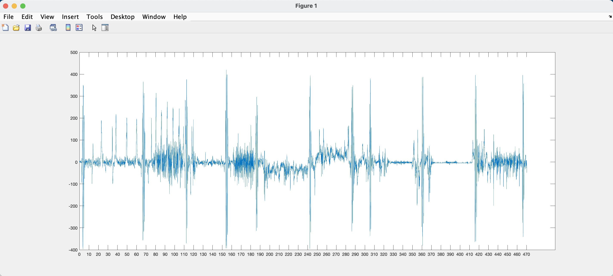
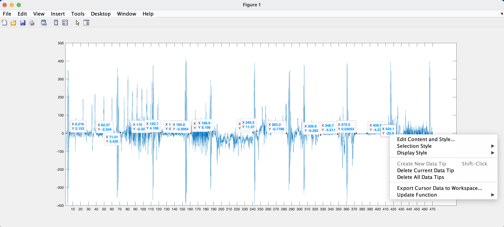
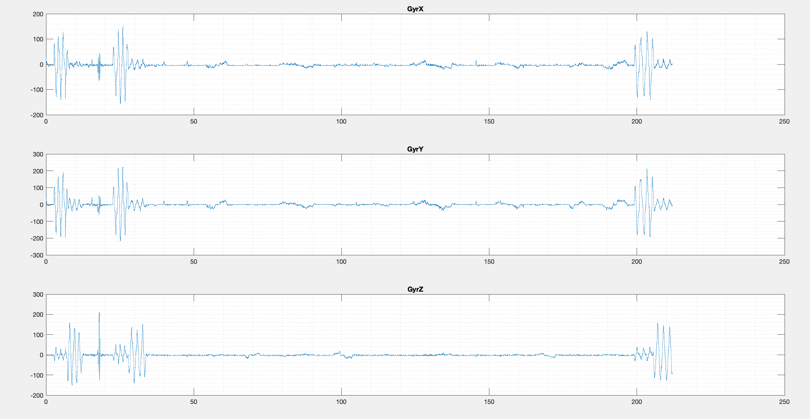
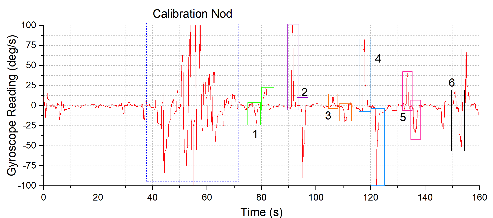
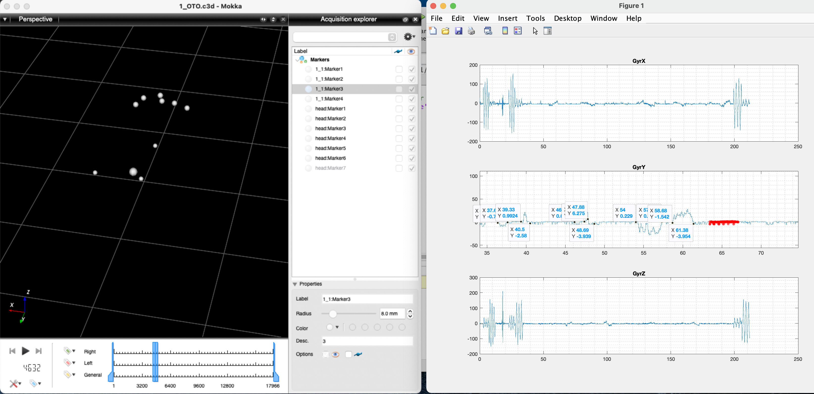

# Data Labeling Module

There are four folders in this module.
- For the ```Activity```, ```Complex Head Pose``` and ```Simple Head Pose``` folders, we provide two MATLAB scripts. The first script plots the raw earable data and the second script is used for automatic segmentation and labeling.
- The folder titled ```Sample Raw Earable Data Files``` contains raw activity and head-pose files collected from the earable and through our Android application. These files can be used as demo to practice labeling earable activity and head-pose datasets.

### How to do labeling for activity detection?

- Run ```Script_1_act.m``` to plot the activity data. Input directory to the appropriate activity data file in line 3 before running the script. You can use the sample raw activity data file given in  ```Sample Raw Earable Data Files```, or use one of the files in ```Dataset/Activity Detection/Continuous```. You would see a plot like this:

- Notice the large peaks in the plot. These correspond to calibration nods that separate each activity. In our case, we know that we recorded the activity data in the order: walking, jogging, standing, jumping, turning left, turning right, sitting, laying and falling. You should select points that signify the start and end of each activity. Make sure you click the points in order.

- Right click on any one of the points and select ```Export Cursor Data to Workspace```. Click ```OK``` in the upcoming dialogue window. You should see the ```cursor_info``` variable in the workspace now, whose size should be 1X18 (for 9 activities). 
- Run ```Script_2_act.m```. Provide the appropriate subject number. It will automatically create a folder with appropriate subject ID and slice the activity data automatically. It will place the labelled data in the current directory as ```sliced/X/```, where X is the subject ID. Note that you can modify this script to support additional activities or lower number of activities.

### How to do labeling for simple head-pose?

- Run ```Script_1_SHP.m``` to plot the head-pose data. Input directory to the appropriate simple head-pose data file in line 3 before running the script. You can use the sample raw simple head-pose data file given in  ```Sample Raw Earable Data Files```, or use one of the files in ```Dataset/Simple Head Pose/X/X_OTO.csv```, where X is a participant ID. You would see a plot like this:

- Open the corresponding ground truth ```.tak``` file in Motive:Tracker, or the ```.c3d``` file in Mokka.
- With the help of the ground truth videos, start clicking on the start and end points of each head movement. A single head rotation on the gyroscope time plot essentially consists of a triangular/bell-shaped curve peak. Faster head-movements result in thinner and taller peaks, slower head-movements results in thicker and smaller peaks. For simple head movements, you will see a group of two peaks together (origin to target, target to origin). Make sure you click the points in order and only place points on one of the three gyroscope plots. Note that the first two and last two points should signify the starts and ends of beginning and terminating calibration nods. In addition, you can use the ```brush``` function in the MATLAB figure window to select erroneous regions in the plot and correct them (they will show up as red in the plot, you can go to ```Tools > Brushing > Replace With > Constants``` in the MATLAB figure window to specify correction for a specific brushed region.


- Right click on any one of the points and select ```Export Cursor Data to Workspace```. Click ```OK``` in the upcoming dialogue window. You should see the ```cursor_info``` variable in the workspace now, whose size should be 1X(4n+4), where n is the number of targets.
- Run ```Script_2_SHP.m```. Provide the appropriate subject number. It will automatically create a folder with appropriate subject ID and label the rows of the IMU data. It will place the labelled data in the current directory as ```sliced_HP/X/```, where X is the subject ID. Note that you can modify this script to support additional head poses or lower number of head poses.


### How to do labeling for complex head-pose?

The labeling is similar to simple head-pose, except you will have a group of three bell curves (origin to target A, target A to target B, target B to origin) instead of two. The ```cursor_info``` variable should have size of whose size should be 1X(6m+4), where m is the number of target groups (each group has two targets).
