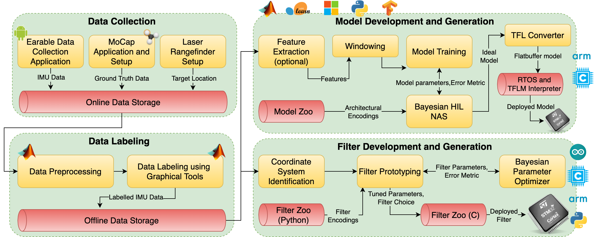

# Auritus - An Open Source Optimization Toolkit for Training and Deployment of Human Movement Models and Filters Using Earables



## Summary
Smart ear-worn devices (called earables) are being equipped with various onboard sensors and algorithms, transforming earphones from simple audio transducers to multi-modal interfaces making rich inferences about human motion and vital signals. However, developing and deploying sensory applications using earables is currently quite cumbersome with several barriers in the way. First, time-series data from earable sensors incorporate information about physical phenomena in complex settings, requiring machine-learning (ML) models learned from large-scale labeled data. This is challenging in the context of earables because large-scale open-source datasets are missing. Secondly, the small size and compute constraints of earable devices make on-device integration of many existing algorithms for tasks such as human activity and head-pose estimation difficult. To address these challenges, we introduce Auritus, an extendable and open-source optimization toolkit designed to enhance and replicate earable applications. Auritus serves two primary functions. Firstly, Auritus handles data collection, pre-processing, and labeling tasks for creating customized earable datasets using graphical tools. The system includes an open-source dataset with 2.43 million inertial samples related to head and full-body movements, consisting of 34 head poses and 9 activities from 45 volunteers. Secondly, Auritus provides a tightly-integrated hardware-in-the-loop (HIL) optimizer and TinyML interface to develop and deploy lightweight and real-time machine-learning (ML) models for activity detection and filters for head-pose tracking. To validate the utlity of Auritus, we showcase three sample applications, namely fall detection, spatial audio rendering, and augmented reality (AR) interfacing. Auritus recognizes activities with 98% test accuracy using real-time models as small as 6 kB. Our models are 98x smaller and 6% more accurate over the state-of-the-art. We also estimate head pose with absolute errors as low as 5 degrees using 20kB filters, achieving up to 1.6x precision improvement over existing techniques. We make the entire system open-source so that researchers and developers can contribute to any layer of the system or rapidly prototype their applications using our dataset and algorithms.

## Framework Architecture

There are four modules in Auritus. We provide the necessary code and guide to work with each module in four models, namely ```Data Collection Module```, ```Data Labeling Module```, ```Filter Development and Deployment```, and ```Model Development and Deployment```. We also provide the dataset in the ```Dataset``` folder. Each folder has extensive guides on how to use the contents of each module. Lastly, we provide code for the three canonical applications we showcased in the paper in the folder titled ```Applications```, namely fall detection, binaural audio rendering and interacting with AR frameworks.

## Required items if you want to collect your own dataset
- An Android Smartphone 
- eSense earables from Nokia Bell Labs (check Data Collection Module)
- Optitrack MoCap Setup with Motive:Tracker software (check Data Collection Module)
- Mokka toolkit (optional, check Data Collection Module)
- A cap where Optitrack markers can be attached to 
- Laser RangeFinder (check Data Collection Module)
- Digital Compass (check Data Collection Module)
- Sticky Notes
- Laser Pointer

## Required items for all modules
- A computer running MacOS (if you want to collect your own data, perform labeling and use MATLAB coder).
- A GPU Workstation running Ubuntu 20.04 (to train TinyML models and perform NAS).
- MATLAB R2021b (with Classification Learner, MATLAB Coder, and Neural Network Pattern Recognition apps) must be installed on both machines. The three apps are available via the Statistics and Machine Learning Toolbox and MATLAB coder. https://www.mathworks.com/products/matlab.html, https://www.mathworks.com/products.html
- Python 3.8+ must be installed on both machines, preferably through Anaconda or Virtualenv, https://docs.conda.io/en/latest/, https://virtualenv.pypa.io/en/latest/
- Python package requirements are listed in the folders for each modules. Please install them before running the Python scripts. Note that Tensorflow 2.5.0 is a must for working with the TinyML model scripts. Tensorflow 1.x would not work.
- Couple of STM32 Nucleo Boards (must be Mbed enabled) for hardware-in-the-loop NAS, https://www.st.com/en/evaluation-tools/stm32-nucleo-boards.html, https://os.mbed.com/platforms/
- Arduino IDE, https://www.arduino.cc/en/software/
- C/C++ compiler for MATLAB coder, Arduino IDE, Mbed CLI and conversion of TinyML models to C (your computer will generally come with one).
- GNU ARM Embedded Toolchain (for Mbed CLI), https://developer.arm.com/tools-and-software/open-source-software/developer-tools/gnu-toolchain/gnu-rm

## How to contribute to Auritus

If you want to contribute to any layer (including the dataset and applications) of Auritus, please email us at swapnilsayan@g.ucla.edu or mbs@ucla.edu (Prof. Mani Srivastava, UCLA) regarding your contribution. We are happy to host interesting applications or improvements (or tools).

## Citation
Please cite this as:

Saha S.S., Sandha S.S., Pei S., Jain V., Wang Z., Li Y., Sarker A., Srivastava M. (2021) Auritus - An Open Source Optimization Toolkit for Training and Deployment of Human Movement Models and Filters Using Earables. (Under Review) Proceedings of the ACM on Interactive, Mobile, Wearable and Ubiquitous Technologies (2021): 1-30.

## Acknowledgements
We thank Nokia Bell Labs for providing us with the eSense earable hardware, which we used in this framework and the paper.

The research reported in this paper was sponsored in part by: the CONIX Research Center, one of six centers in JUMP, a Semiconductor Research Corporation (SRC) program sponsored by DARPA; by the IoBT REIGN Collaborative Research Alliance funded by the Army Research Laboratory (ARL) under Cooperative Agreement W911NF-17-2-0196; by the NIH mHealth Center for Discovery, Optimization and Translation of Temporally-Precise Interventions (mDOT) under award 1P41EB028242; by the National Science Foundation (NSF) under awards \# OAC-1640813 and CNS-1822935; and, by and the King Abdullah University of Science and Technology (KAUST) through its Sensor Innovation research program. The views and conclusions contained in this document are those of the authors and should not be interpreted as representing the official policies, either expressed or implied, of the ARL, DARPA, KAUST, NIH, NSF, SRC, or the U.S. Government. The U.S. Government is authorized to reproduce and distribute reprints for Government purposes notwithstanding any copyright notation here on.


